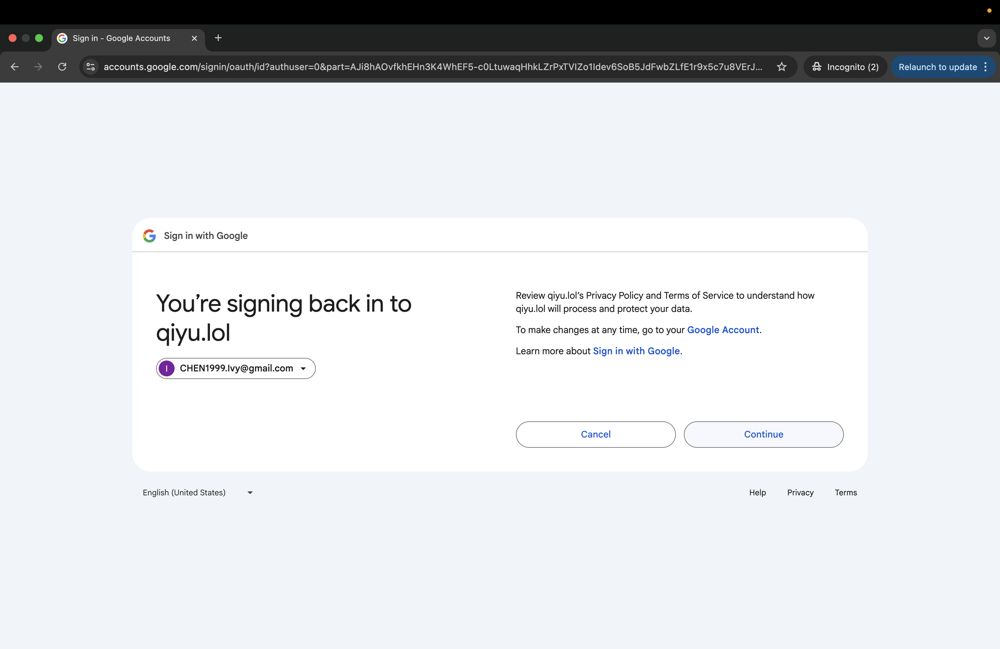

# Project 2: High-Availability Portfolio with OAuth and GitHub Contributions

## Part 1: OAuth Integration and Portfolio Extension

This section documents the implementation of Google OAuth login for secure access control and the integration of a GitHub contributions calendar into the portfolio project.

### Step 1: Google OAuth Integration

1. Create Virtual Environment and Install Dependencies:

```
ssh -i /Users/qiyuchen/.ssh/linux-key.pem ubuntu@44.208.36.88
```
```
python3 -m venv venv
source venv/bin/activate
```
```
pip install Flask Flask-Session Authlib
```
2. Set Up OAuth Credentials:

- Go to Google Cloud Console.

- Create OAuth 2.0 Client ID (Web Application).

- Set the following:
  - Authorized JavaScript origins:
https://portfolio.play.qiyu.lol
  - Authorized redirect URIs:
https://portfolio.play.qiyu.lol/login/google/authorized

3. Configure OAuth in Flask (app.py):
```
from authlib.integrations.flask_client import OAuth

oauth = OAuth(app)
google = oauth.register(
    name='google',
    client_id='YOUR_CLIENT_ID',
    client_secret='YOUR_CLIENT_SECRET',
    server_metadata_url='https://accounts.google.com/.well-known/openid-configuration',
    client_kwargs={
        'scope': 'openid email profile',
        'prompt': 'consent'
    }
)
```
4. Login and Callback Routes:
```
@app.route("/login/google")
def login_google():
    redirect_uri = url_for("authorize", _external=True)
    return google.authorize_redirect(redirect_uri)

@app.route("/login/google/authorized")
def authorize():
    token = google.authorize_access_token()
    user_info = google.get("https://openidconnect.googleapis.com/v1/userinfo").json()
    session["username"] = user_info["name"]
    session["role"] = "admin"
    return redirect("/")
```
5. Usage in the App:
```
@app.route("/")
def index():
    user = session.get("username", "Tourist")
    return render_template("index.html", username=user)
```
6. Restart Gunicorn
```
sudo systemctl restart gunicorn
```
7. Final Result
- Click Sign in with Google 


- Click User Email


- Click Continue



- Now Logged in as Ivy


### Step 2: Adding GitHub Contributions Section


## Part2 High-Availability Setup with Load Balancing

### Step 1 Preparing Nginx Instances

lauch 2 instance 

back-1 184.72.134.13
ssh -i /Users/qiyuchen/.ssh/linux-key.pem ubuntu@184.72.134.13
back-2 54.90.237.63
ssh -i /Users/qiyuchen/.ssh/linux-key.pem ubuntu@54.90.237.63

install nginx
```
sudo apt update
sudo apt install nginx -y
```
Edit Nginx Configuration for Load Balancing:
```
sudo nano /etc/nginx/sites-available/load_balancer.conf
```
```
server {
    listen 80;

    location / {
        proxy_pass https://portfolio.play.qiyu.lol/;
        proxy_ssl_server_name on;
        proxy_ssl_verify off;

        proxy_set_header Host portfolio.play.qiyu.lol;
        proxy_set_header X-Real-IP $remote_addr;
        proxy_set_header X-Forwarded-For $proxy_add_x_forwarded_for;
        proxy_set_header X-Forwarded-Proto $scheme;
    }
}
```
Enable your config and disable default
```
sudo ln -s /etc/nginx/sites-available/reverse_proxy.conf /etc/nginx/sites-enabled/
sudo rm /etc/nginx/sites-enabled/default
```
Test and restart Nginx
```
sudo nginx -t
sudo systemctl restart nginx
```

curl https://portfolio.play.qiyu.lol

### Step 2 Configuring HAProxy
ssh -i /Users/qiyuchen/.ssh/linux-key.pem ubuntu@3.90.190.171

Install HAProxy SSH into the HAProxy instance and install HAProxy:
```
sudo apt update
sudo apt install haproxy -y
```
Configure HAProxy with AWS Backend Servers Open the HAProxy configuration file:
```
sudo nano /etc/haproxy/haproxy.cfg
```
Set up a frontend to listen on port 80 and define your backend servers:
```
frontend http_front
    bind *:80
    default_backend aws_backends

backend aws_backends
    balance roundrobin
    server back-1 172.31.20.181:80 check
    server back-2 172.31.25.142:80 check
```

sudo systemctl restart haproxy
sudo systemctl status haproxy
