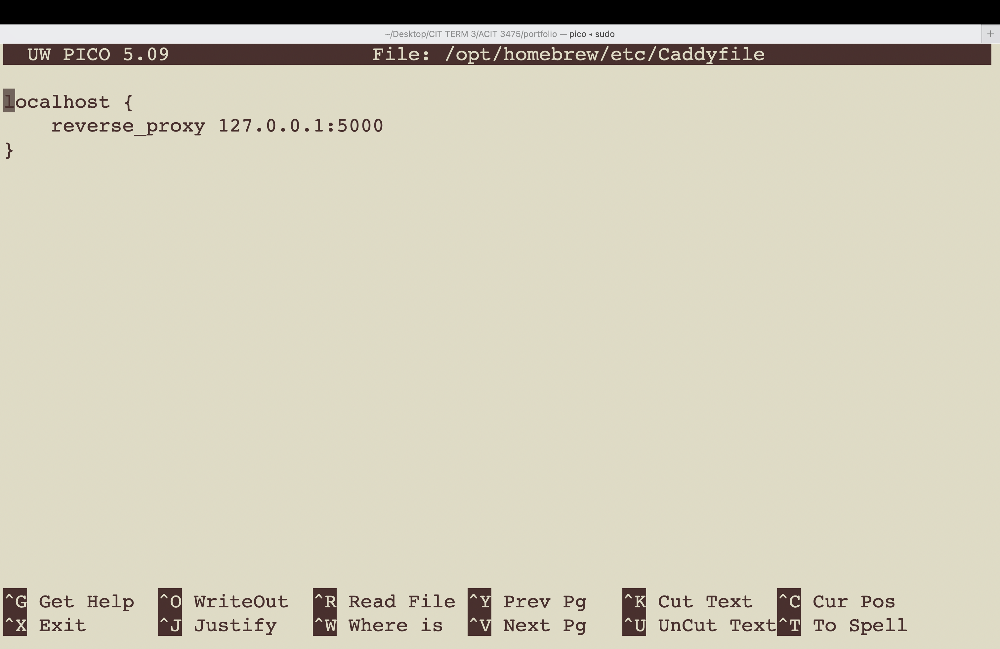
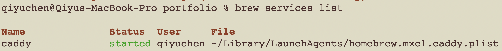
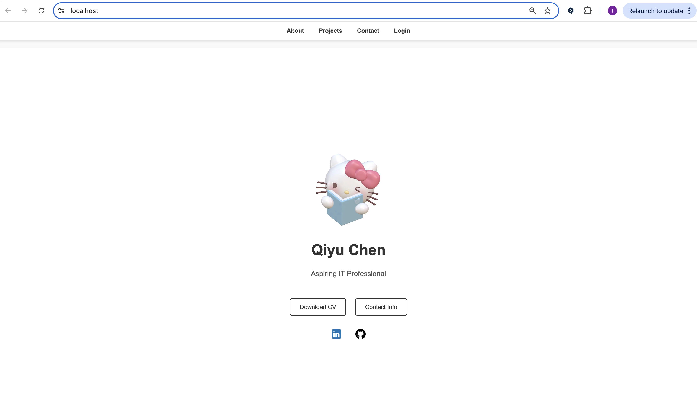

# Portfolio Deployment with Caddy and Flask

This guide documents the steps to set up a local development environment for serving a Flask-based portfolio website using Caddy as a reverse proxy in macOS

---
## Step 1: Install Caddy Locally

1. Install Caddy using Homebrew:
   ```
   brew install caddy
   ```
2. Verify the installation:
   ```
   caddy version
   ```
   

3. Create a global Caddyfile:
   ```
   sudo touch /opt/homebrew/etc/Caddyfile
   ```

4. Open the Caddyfile for editing:
   ```
   sudo nano /opt/homebrew/etc/Caddyfile
   ```

5. Add the following configuration to serve Flask through Caddy:
   ```
   localhost {
       reverse_proxy 127.0.0.1:5000
   }
   ```

6. Save the file and exit.

---

## Step 2: Trust Caddy's Self-Signed Certificate (HTTPS Support)
1. Run the following command to trust Caddy’s self-signed certificate:
   ```
   sudo caddy trust
   ```
   **Note:** This installs the certificate in macOS keychain.

2. Restart Caddy as a background service:
   ```
   brew services restart caddy
   ```

3. Verify Caddy is running:
   ```
   brew services list
   ```
   

---
## Step 3: Access the Portfolio Website
1. Open a browser and go to:
   ```
   https://localhost
   ```

---

## Screenshots
- **Caddyfile Configuration**

- **Brew Services List Output**

- **Confirmation**


---
## References
- [Caddy Documentation](https://caddyserver.com/docs/quick-starts/reverse-proxy)

- [Using Caddy as a Reverse Proxy](https://jannik.io/article/using-caddy-for-local-development/)

