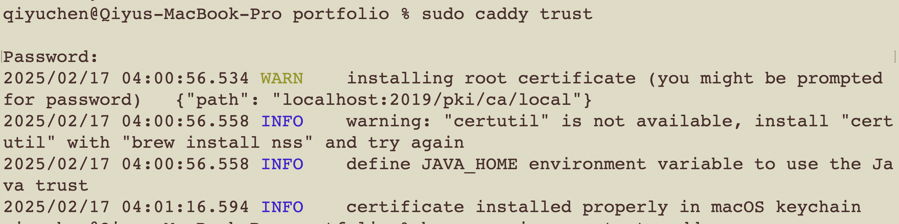
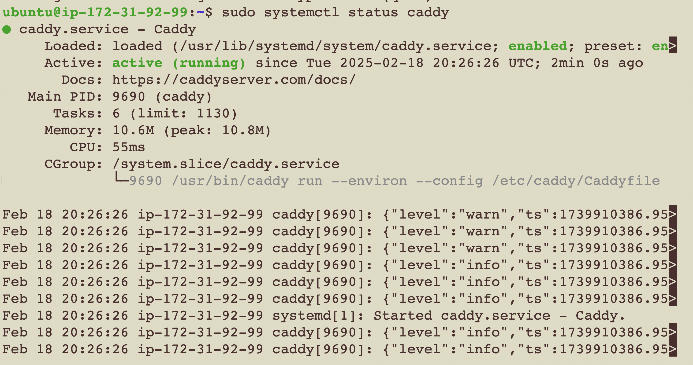
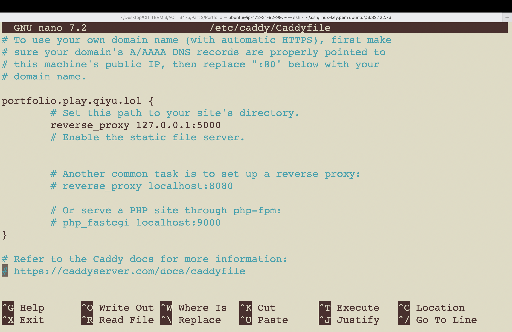
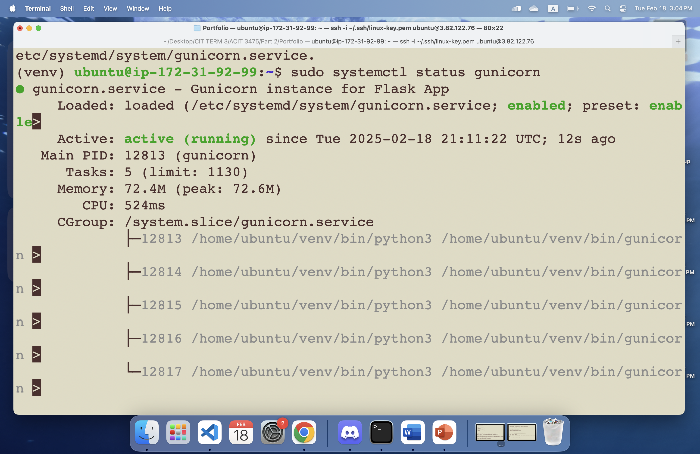
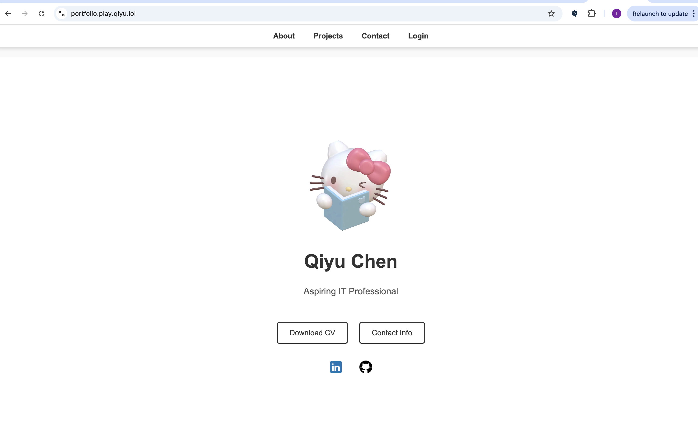

# Web Project 1 
Name: Qiyu (Ivy) Chen  

StudentID: A01338328

This project consists of three main parts:

1. Research Caddy – Deliver a video presentation on its features and use cases.
2. Local Deployment – Set up and serve a Flask-based portfolio website on macOS using Caddy.
3. Cloud Deployment – Deploy the portfolio website on an AWS EC2 instance, configure Caddy for HTTPS, and use Gunicorn to serve the application.

## Part 2 Portfolio Deployment with Caddy

This guide documents the steps to set up a local development environment for serving a Flask-based portfolio website using Caddy as a reverse proxy in macOS.

### Step 1: Install Caddy Locally

1. Install Caddy using Homebrew:
   ```
   brew install caddy
   ```
2. Verify the installation:
   ```
   caddy version
   ```
   
3. Create a global `Caddyfile`:
   ```
   sudo touch /opt/homebrew/etc/Caddyfile
   ```

4. Open the `Caddyfile` for editing:
   ```
   sudo nano /opt/homebrew/etc/Caddyfile
   ```

5. Add the following configuration to serve Flask through Caddy:
   ```
   localhost {
       reverse_proxy 127.0.0.1:5000
   }
   ```
   

6. Save the file and exit.

### Step 2: Trust Caddy's Self-Signed Certificate (HTTPS Support)
1. Run the following command to trust Caddy’s self-signed certificate:
   ```
   sudo caddy trust
   ```
   **Note:** This installs the certificate in macOS keychain.
   

2. Restart Caddy as a background service:
   ```
   brew services restart caddy
   ```

3. Verify Caddy is running:
   ```
   brew services list
   ```
   
   

### Step 3: Access the Portfolio Website
1. Open a browser and go to:
   ```
   https://localhost/
   ```
   

---
## Part 3 Cloud Deployment and Domain Setup 
In this part, I will deploy the Flask portfolio website to a cloud server using AWS EC2. I will also set up Caddy for HTTPS and configure Gunicorn to serve the Flask application.

### Step 1 Connect to the Cloud Instance
1. Launch an Ubuntu instance using AWS
```
Instance type: t2.micro
OS: Ubuntu Server 24.04 LTS
Security group:
 - SSH: 22
 - HTTP: 80
 - HTTPS: 443
```
2. Use SSH to connect to your AWS EC2 instance

```
ssh -i /Users/qiyuchen/.ssh/linux-key.pem ubuntu@3.82.122.76
```
### Step 2 Install Caddy
Caddy will handle automatic HTTPS and act as a reverse proxy for Flask app.

1. Install Dependencies and Caddy
```
sudo apt install -y debian-keyring debian-archive-keyring apt-transport-https curl
curl -1sLf 'https://dl.cloudsmith.io/public/caddy/stable/gpg.key' | sudo gpg --dearmor -o /usr/share/keyrings/caddy-stable-archive-keyring.gpg
curl -1sLf 'https://dl.cloudsmith.io/public/caddy/stable/debian.deb.txt' | sudo tee /etc/apt/sources.list.d/caddy-stable.list
sudo apt update
sudo apt install caddy
```
2. Check Caddy Status
```
sudo systemctl status caddy
```


### Step 3 Transfer Project Files to the Cloud Server
```
scp -i ~/.ssh/linux-key.pem -r . ubuntu@3.82.122.76:~
```
This transfers all files from my local machine on the portfolio directory to the home directory of my cloud instance.

### Step 4 Set Up Python & Virtual Environment
1. Install Python & Pip
```
sudo apt update && sudo apt install -y python3 python3-pip
```
2. Create a Virtual Environment
```
sudo apt install -y python3-venv
python3 -m venv venv
source venv/bin/activate
```
3. Install Flask and Gunicorn
```
pip install flask-session gunicorn
```
### Step 5 Configure Caddy for the Domain
Since I set up `portfolio.play.qiyu.lol` as my domain, I need to configure Caddy.

1. Edit the Caddyfile:
```
sudo nano /etc/caddy/Caddyfile
```
Add the following configuration:
```
portfolio.play.qiyu.lol {
    reverse_proxy 127.0.0.1:5000
}
```


Caddy will forward all traffic from `portfolio.play.qiyu.lol` to my Flask app running on port 5000. This allows users to access the site via the domain instead of using an IP and port.

2. Restart Caddy
```
sudo systemctl restart caddy
```
### Step 6 Set Up Gunicorn (WSGI Server)
Flask’s built-in server (flask run) is meant for development and cannot handle concurrent requests efficiently. Gunicorn is a production-ready WSGI server that allows multiple users to access the site at once.

1. Run Gunicorn Manually (For Testing)
```
gunicorn -w 4 -b 0.0.0.0:5000 app:app
```
2. Set Up Gunicorn as a Systemd Service

```
sudo nano /etc/systemd/system/gunicorn.service
```
```
[Unit]
Description=Gunicorn instance for Flask App
After=network.target

[Service]
User=ubuntu
Group=www-data
WorkingDirectory=/home/ubuntu
Environment="PATH=/home/ubuntu/venv/bin"
ExecStart=/home/ubuntu/venv/bin/gunicorn -w 4 -b 0.0.0.0:5000 app:app

[Install]
WantedBy=multi-user.target
```
3. Start Gunicorn
```
sudo systemctl daemon-reload
sudo systemctl start gunicorn
sudo systemctl enable gunicorn
```
Check status:
```
sudo systemctl status gunicorn
```

### Step 7 Final Testing
Open a browser and go to:
```
https://portfolio.play.qiyu.lol
```


