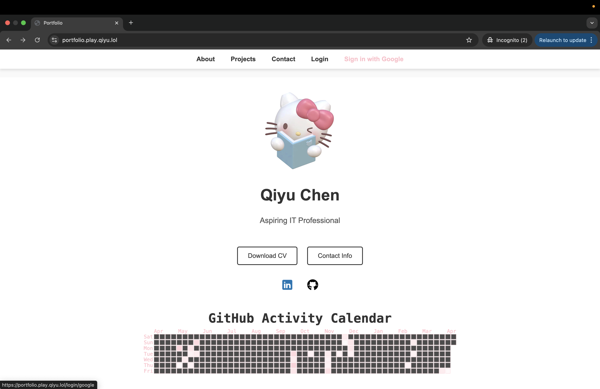
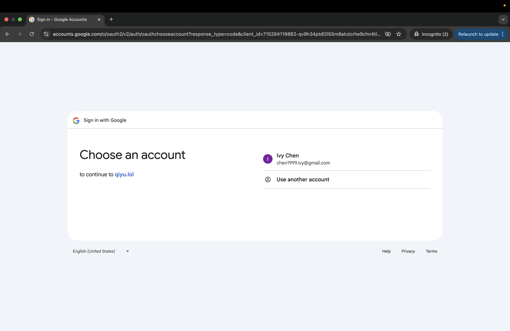
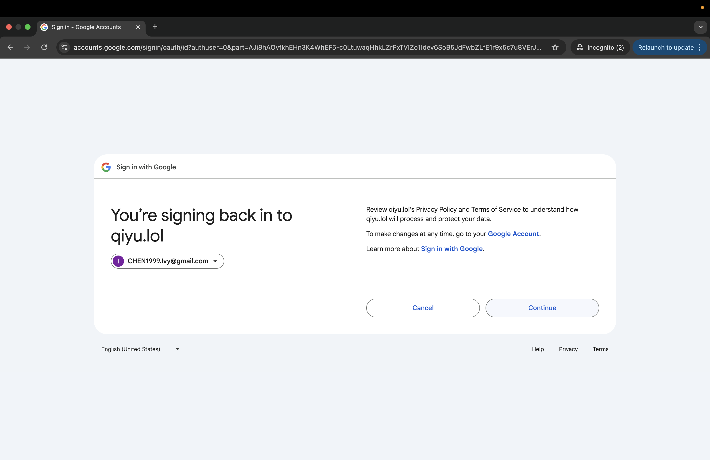
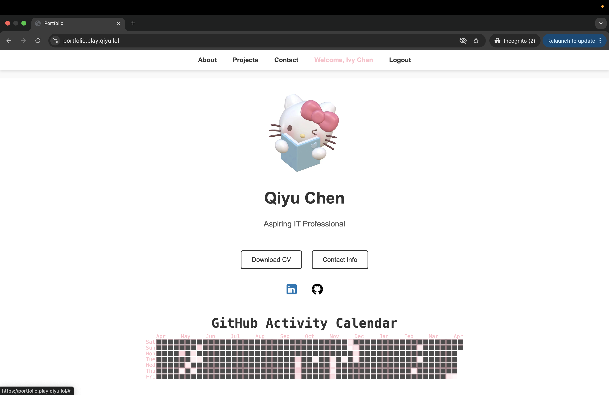
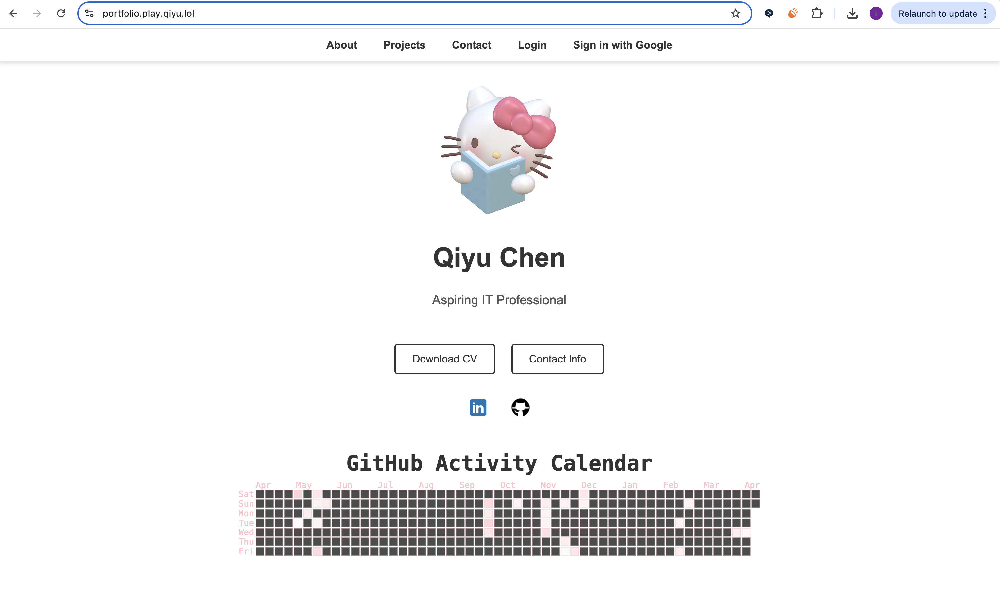
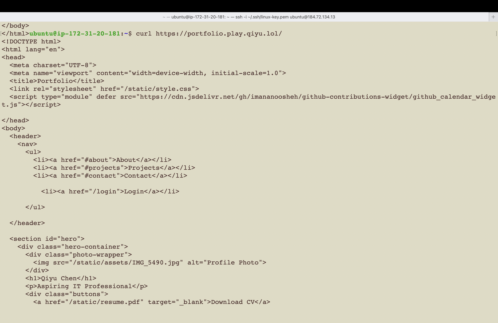
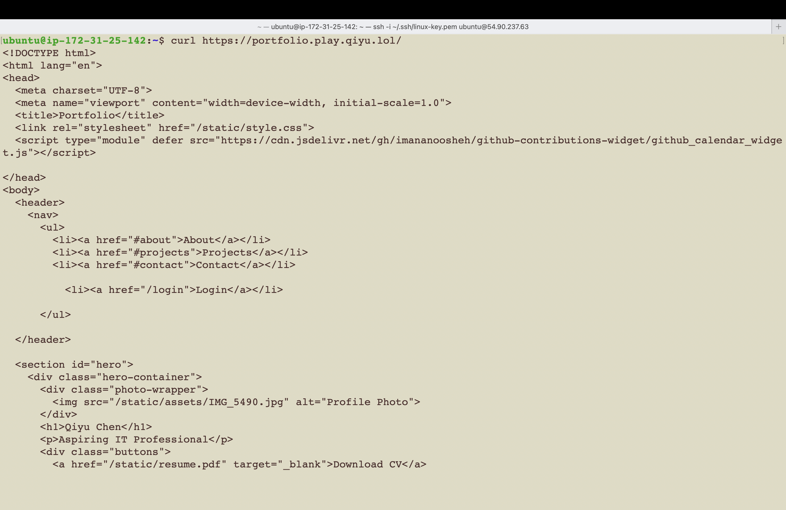
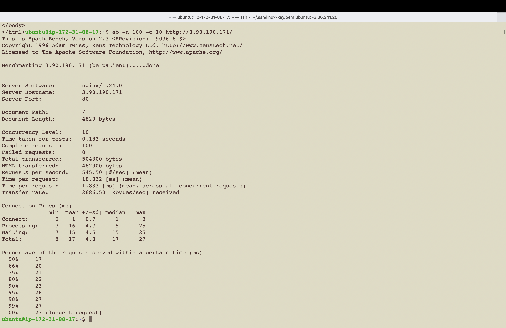

# Project 2: High-Availability Portfolio with OAuth and GitHub Contributions

## Part 1: OAuth Integration and Portfolio Extension

This section documents the implementation of Google OAuth login for secure access control and the integration of a GitHub contributions calendar into the portfolio project.

### Step 1: Google OAuth Integration

1. Create Virtual Environment and Install Dependencies:

```
ssh -i /Users/qiyuchen/.ssh/linux-key.pem ubuntu@44.208.36.88
```
```
python3 -m venv venv
source venv/bin/activate
```
```
pip install Flask Flask-Session Authlib
```
2. Set Up OAuth Credentials:

- Go to the [Google Cloud Console](https://console.cloud.google.com/).

- Create OAuth 2.0 Client ID (Web Application).

- Set the following:
  - Authorized JavaScript origins:
https://portfolio.play.qiyu.lol
  - Authorized redirect URIs:
https://portfolio.play.qiyu.lol/login/google/authorized

3. Configure OAuth in Flask (app.py):
```
from authlib.integrations.flask_client import OAuth

oauth = OAuth(app)
google = oauth.register(
    name='google',
    client_id='YOUR_CLIENT_ID',
    client_secret='YOUR_CLIENT_SECRET',
    server_metadata_url='https://accounts.google.com/.well-known/openid-configuration',
    client_kwargs={
        'scope': 'openid email profile',
        'prompt': 'consent'
    }
)
```
4. Login and Callback Routes:
```
@app.route("/login/google")
def login_google():
    redirect_uri = url_for("authorize", _external=True)
    return google.authorize_redirect(redirect_uri)

@app.route("/login/google/authorized")
def authorize():
    token = google.authorize_access_token()
    user_info = google.get("https://openidconnect.googleapis.com/v1/userinfo").json()
    session["username"] = user_info["name"]
    session["role"] = "admin"
    return redirect("/")
```
5. Usage in the App:
```
@app.route("/")
def index():
    user = session.get("username", "Tourist")
    return render_template("index.html", username=user)
```
6. Restart Gunicorn
```
sudo systemctl restart gunicorn
```
7. Final Result
- Click Sign in with Google 



- Click User Email



- Click Continue



- Now Logged in as Ivy




### Step 2: Adding GitHub Contributions Section

Source: [github-contributions-widget](https://github.com/imananoosheh/github-contributions-widget)

1. Include the Script:

Add the following to head tag in HTML file:
```
<script type="module" defer src="https://cdn.jsdelivr.net/gh/imanasoosheh/github-contributions-widget@latest/dist/github-contributions-widget.js"></script>
```
2. Add a container in HTML where I want the calendar to appear
```
<!-- GitHub Contributions Calendar -->
<div class="github-calendar-wrapper">
  <div class="calendar-align">
    <div id="calendar-component"
         username="ICCCIVY"
         background-color="#FFFFFF"
         theme-color="#FFC0CB">
    </div>
  </div>
</div>
```
3. Final result look like this:




## Part2 High-Availability Setup with Load Balancing

This documentation outlines the steps to set up a high-availability architecture for a portfolio website using two Nginx reverse proxies and one HAProxy instance for load balancing.


### Step 1 Preparing Nginx Instances

1. Launch Two EC2 Instances:
- back-1 `184.72.134.13`
```
ssh -i /Users/qiyuchen/.ssh/linux-key.pem ubuntu@184.72.134.13
```
- back-2 `54.90.237.63`
```
ssh -i /Users/qiyuchen/.ssh/linux-key.pem ubuntu@54.90.237.63
```
2. Install Nginx on Both Instances:
```
sudo apt update
sudo apt install nginx -y
```
3. Configure Nginx as a Reverse Proxy:
```
sudo nano /etc/nginx/sites-available/reverse_proxy.conf
```
- Paste the following:
```
server {
    listen 80;

    location / {
        proxy_pass https://portfolio.play.qiyu.lol/;
        proxy_ssl_server_name on;
        proxy_ssl_verify off;

        proxy_set_header Host portfolio.play.qiyu.lol;
        proxy_set_header X-Real-IP $remote_addr;
        proxy_set_header X-Forwarded-For $proxy_add_x_forwarded_for;
        proxy_set_header X-Forwarded-Proto $scheme;
    }
}
```
4. Enable the Config and Remove Default
```
sudo ln -s /etc/nginx/sites-available/reverse_proxy.conf /etc/nginx/sites-enabled/
sudo rm /etc/nginx/sites-enabled/default
```
5. Restart Nginx
```
sudo nginx -t
sudo systemctl restart nginx
```
6. Test with `curl `
```
curl https://portfolio.play.qiyu.lol
```




### Step 2 Configuring HAProxy
1. Launch a Third EC2 Instances for HAProxy
```
ssh -i /Users/qiyuchen/.ssh/linux-key.pem ubuntu@3.90.190.171
```
2. Install HAProxy:
```
sudo apt update
sudo apt install haproxy -y
```
3. Configure HAProxy:
```
sudo nano /etc/haproxy/haproxy.cfg
```
4. Append the following configuration:
```
frontend http_front
    bind *:80
    default_backend aws_backends

backend aws_backends
    balance roundrobin
    server back-1 172.31.20.181:80 check
    server back-2 172.31.25.142:80 check
```
5. Restart HAProxy:
```
sudo systemctl restart haproxy
sudo systemctl status haproxy
```
6. Test 
```
curl 3.90.190.171
```
## Part 3: Scalability, Performance, and Documentation 
To test the reliability and responsiveness of HAProxy load-balanced portfolio setup, I simulated concurrent traffic using Apache Bench:

### Step 1: Scalability and Performance Testing

1. Launch a New EC2 Instance for Testing
```
ssh -i /Users/qiyuchen/.ssh/linux-key.pem ubuntu@3.86.241.20
```
2. Install Apache Benchmark
```
sudo apt update
sudo apt install apache2-utils -y
```
3. Run:
```
ab -n 100 -c 10 http://3.90.190.171/
```
This tells ApacheBench (ab) to:
- -n 100 → Send 100 total requests
- -c 10 → Send 10 requests at a time (concurrent)



- Total Requests: 100
- Concurrency Level: 10
- Failed Requests: 0 
- Requests Per Second: 545.50 [#/sec] (mean)
- Mean Time Per Request: 18.33 ms
- Transfer Rate: 2686.50 Kbytes/sec
- Max Request Time: 27 ms

This shows that the HAProxy instance successfully distributed traffic between two backend Nginx instances. All requests were processed under 27 ms, indicating excellent performance under concurrent load.